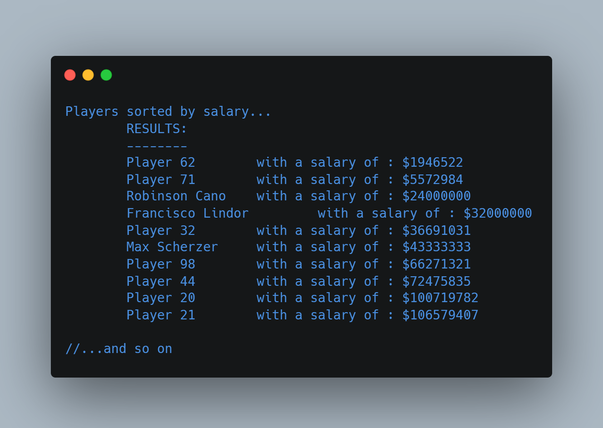
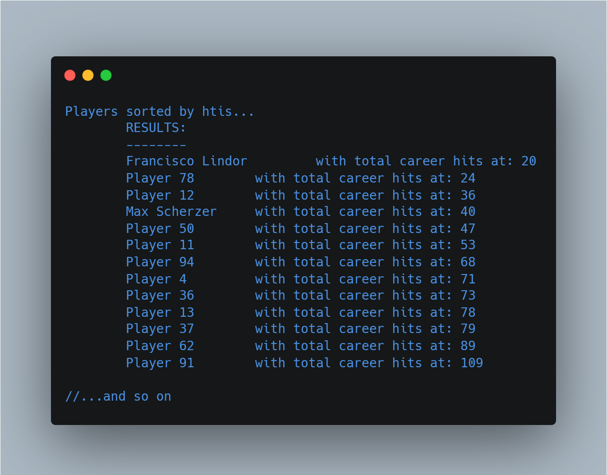
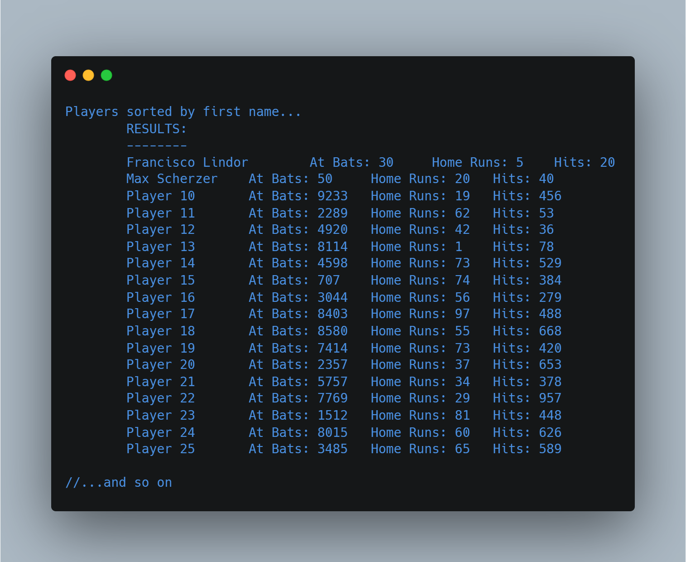

# IComparable Enumeration Types

(FSC-BCS-426-Lab7)

## Output Menu

## Assignment Context

This project was one of the later assignments for my C# Programming class.

The goal of this assignment was to further explore C# by implementing enums and the IComparable interface. 

This was a solo assignment made with C#, and Visual Studio 2022.

## Features

To use the program, simply run the console application and follow the prompts. 
The user is presented with a main menu and can select from the available options.

1. **Salary** - Displays a list of employees sorted by their salaries in ascending order. 
2. **Hits** - Displays a list of baseball players sorted by their total hits in ascending order.
3. **Name** - Displays a list of employees sorted by their last names in ascending order.
4. **Exit** - Closes the application.

Each option allows the user to perform a different operation on the data.
Once the operation is complete, the program returns to the main menu.

## How It Works

### Option 1: Sort by Salary

When the user selects the "Salary" option, the application reads a CSV file of employees and their salaries. 
It then creates an object of the `Employee` class for each employee in the file and adds it to a list. 
The application then sorts the list using the `IComparable` interface and displays the sorted list of employees with their salaries in ascending order.

#### Output:

### Option 2: Sort by Hits

When the user selects the "Hits" option, the application reads a CSV file of baseball players and their total hits. 
It then creates an object of the `BaseballPlayer` class for each player in the file and adds it to a list. 
The application then sorts the list using the `IComparable` interface and displays the sorted list of players with their total hits in ascending order.

#### Output:

### Option 3: Sort by Name

When the user selects the "Name" option, the application reads a CSV file of employees and their last names. 
It then creates an object of the `Employee` class for each employee in the file and adds it to a list. 
The application then sorts the list using the `IComparable` interface and displays the sorted list of employees with their last names in ascending order.

#### Output:

### Option 4: Exit

This option simply exits the application.
