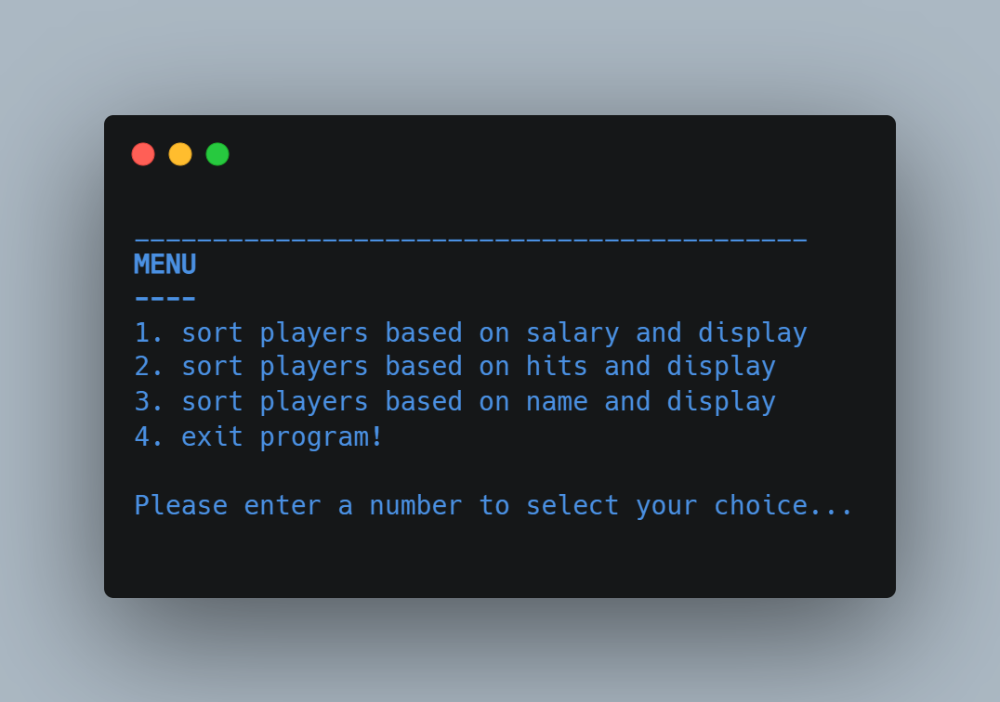

# IComparable Enumeration Types

(FSC-BCS-426-Lab7)

This console application explores the use of C# enums and the implementation of IComparable into custom classes to compare types.

## Assignment Context

This project was one of the later assignments for my C# Programming class.

The goal of this assignment was to further explore C# by implementing enums and the IComparable interface. 

This was a solo assignment made with C#, and Visual Studio 2022.

## Output Menu

## Features

To use the program, simply run the console application and follow the prompts. 
The user is presented with a main menu and can select from the available options.

- Option 1: Sort by Name
- Option 2: Sort by Age
- Option 3: Sort by Salary
- Option 4: Exit

Each option allows the user to perform a different operation on the data.
Once the operation is complete, the program returns to the main menu.

## How It Works

### Option 1: Sort by Name

This option sorts a list of Person objects by their first name in alphabetical order. 
The `Person` class implements the `IComparable` interface, and the `CompareTo` method is overridden to compare two `Person` objects based on their first name.
#### Output:

### Option 2: Sort by Age

This option sorts a list of Person objects by their age from youngest to oldest. 
The `Person` class implements the `IComparable` interface, and the `CompareTo` method is overridden to compare two `Person` objects based on their age.
#### Output:

### Option 3: Sort by Salary

This option sorts a list of Employee objects by their salary from lowest to highest. 
The `Employee` class implements the `IComparable` interface, and the `CompareTo` method is overridden to compare two `Employee` objects based on their salary.
#### Output:

### Option 4: Exit

This option simply exits the application.
